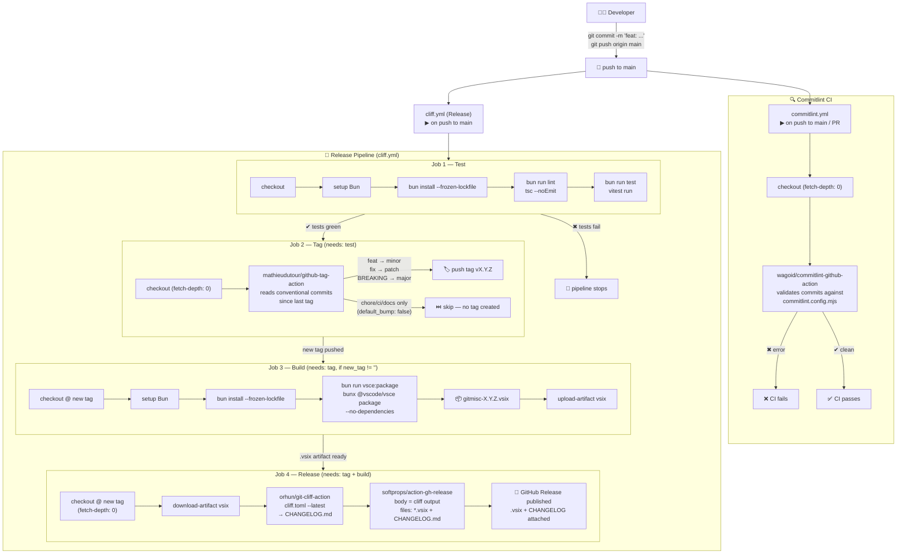

# GitMisc

AI-powered commit message generation for VS Code's Source Control panel.

## Features

- **One-click commit messages** — Press the ✨ button in the Source Control title bar to generate a commit message from your current diff
- **AI chat assistant** — Use `@gitmisc` in the VS Code Chat panel to ask coding and git questions, powered by your own AI provider
- **OpenAI-compatible** — Works with LM Studio, Ollama, OpenAI, or any OpenAI API-compatible provider
- **Streaming responses** — Chat replies stream token-by-token for a responsive experience
- **Conventional Commits** — Generates messages in `type(scope): description` format by default
- **JWT authentication** — Supports Bearer token auth for AI gateways
- **Workspace config** — Configure via a `config.json` file in your workspace root

## Setup

1. Install the extension
2. Ensure you have an OpenAI-compatible API running (e.g., [LM Studio](https://lmstudio.ai/) on `localhost:1234`)
3. Open the Command Palette → **GitMisc: Open Config** to review/edit your configuration

## Configuration

Create or edit `config.json` in your workspace root:

```json
{
  "providers": {
    "commit": {
      "providerUrl": "http://localhost:1234/v1",
      "model": "gemma3:4b",
      "temperature": 0.5,
      "maxTokens": 50000,
      "auth": {
        "type": "none",
        "token": ""
      }
    }
  },
  "commit": {
    "conventionalCommits": true,
    "maxMessageLength": 100
  },
  "ui": {
    "showNotifications": true,
    "theme": "dark"
  }
}
```

### Provider Settings

| Field | Description | Default |
|---|---|---|
| `providerUrl` | Base URL of the OpenAI-compatible API | `http://localhost:1234/v1` |
| `model` | Model name to use | `gemma3:4b` |
| `temperature` | Sampling temperature (0–2) | `0.5` |
| `maxTokens` | Max tokens for the response | `50000` |
| `auth.type` | `"none"` or `"jwt"` | `"none"` |
| `auth.token` | JWT token string, or `$ENV_VAR` to read from environment | `""` |

### Commit Settings

| Field | Description | Default |
|---|---|---|
| `conventionalCommits` | Use Conventional Commits format | `true` |
| `maxMessageLength` | Max characters for the generated message | `100` |

## Usage

1. Make changes in your Git repository
2. (Optionally) stage changes — the extension prefers staged diffs, falls back to unstaged
3. Click the ✨ sparkle icon in the Source Control title bar
4. The generated commit message appears in the commit input box

## Commands

| Command | Description |
|---|---|
| **GitMisc: Generate Commit Message** | Generate a commit message from the current diff |
| **GitMisc: Open Config** | Open or create the `config.json` configuration file |

## Chat Participant

Type `@gitmisc` in the VS Code Chat panel to talk to your configured AI provider directly:

```
@gitmisc Why does my async function not return the expected value?
@gitmisc Review this diff for potential bugs
@gitmisc Explain the difference between rebase and merge
```

The chat participant uses the same provider configuration as the commit-message feature (`providers.commit` in `config.json`) and streams responses token-by-token.

## Development

```bash
npm install
npm run compile    # Build the extension
npm run watch      # Build in watch mode
npm run lint       # Type-check with tsc
```

Press **F5** to launch the Extension Development Host for testing.

## License

MIT
